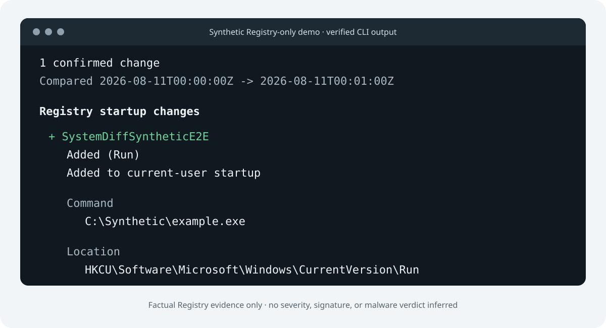

# SystemDiff

[English](README.md) | [简体中文](README.zh-CN.md)

[](https://github.com/XiaojuCH/SystemDiff/actions/workflows/ci.yml)

## 看看应用、安装程序和脚本到底在 Windows 上改了什么。

**离线优先 · 只读 · 无需账号 · 不含遥测**

SystemDiff 会分别创建变更前后的 Snapshot，再说明两者之间有哪些证据发生了变化。它要回答的是这类问题：“我刚安装了这个程序，它改了哪些启动项或 Windows 服务？”

> [!IMPORTANT]
> SystemDiff 仍处于预发布阶段。现阶段真正支持的是采集并比较 Windows Registry 中有官方文档的 Run/RunOnce 启动项，以及当前 token 可见的 Windows 服务配置。符合条件的 CI run 会提供短期有效、未签名的 Windows x64 Developer Preview，但目前没有正式二进制 Release。计划任务、规则、脱敏、正式发布包和桌面应用均尚未实现。

[试用示例](#试用-registry-示例) · [Developer Preview 构建](#developer-preview-构建) · [从源码构建](#从源码构建) · [查看数据格式](docs/data-format.md)



_图中是仓库内 Registry-only synthetic fixtures 生成并经过验证的真实输出，不含真实主机数据。_

## 当前可用能力

| 能力 | 状态 |
| --- | --- |
| 采集当前用户和本机范围内的 Run/RunOnce 证据 | 已在受支持的 Windows 系统上实现 |
| 易读文本、technical 文本和确定性 JSON 三种 Diff 输出 | 已实现 |
| 感知采集覆盖情况，不把缺失证据误报为删除 | 已实现 |
| 采集当前 token 可见的 Windows 服务配置（不含驱动） | 已实现，并采用保守的 partial coverage |
| Scheduled Tasks Collector | 计划中；尚未实现 |
| 规则、数字签名、风险判断和脱敏分享 | 计划中；尚未实现 |

SystemDiff 目前只陈述“已加入当前用户启动项”这类事实，不会判断某个条目是否恶意、安全、已签名或应该删除。

## Developer Preview 构建

`main` 的 CI 成功运行后，会附带保存 14 天的 `systemdiff-windows-x86_64-developer-preview`。这是会过期的 GitHub Actions artifact，不是 GitHub Release，也不代表受支持的正式版本。获取步骤如下：

1. 登录 GitHub，打开一次成功的 [CI workflow run](https://github.com/XiaojuCH/SystemDiff/actions/workflows/ci.yml)；
2. 在页面底部找到 **Artifacts**，下载 `systemdiff-windows-x86_64-developer-preview`；
3. 解压 GitHub 下载的外层压缩包，用旁边的 `SHA256SUMS` 校验 `systemdiff-windows-x86_64.zip`，再解压 portable ZIP；
4. 阅读 `QUICKSTART.md`，运行 `.\systemdiff.exe --help`。

x64 executable 使用 Cargo `release` profile 构建。CI 会检查 PE 架构和 imports，验证内嵌的 `asInvoker` / `uiAccess=false` manifest，并在不调用 Cargo 的情况下运行下载后的 artifact。当前 portable build 静态链接 MSVC CRT，因此实际检查未发现动态 VC/UCRT runtime import；它仍会依赖正常的 Windows system DLL。正式 alpha 前仍需在每个受支持的 Windows 基线环境中做 clean-machine 验证。

此预览没有 Authenticode 签名，Windows 可能显示 SmartScreen 或 reputation 警告。请核对 checksum 和公开源码；SystemDiff 不会要求用户关闭或绕过 Windows 安全保护。通过浏览器下载 Actions artifact 需要登录 GitHub，而且 artifact 会过期，因此这里不会把它包装成最终的公开下载体验。

## 试用 Registry 示例

安装 stable Rust MSVC toolchain 后运行：

```powershell
cargo run --locked --quiet -p systemdiff-cli -- diff fixtures/snapshots/registry-before-v1.json fixtures/snapshots/registry-after-v1.json
```

示例只包含一条 synthetic `HKCU\Software\Microsoft\Windows\CurrentVersion\Run` 新增项。它与上方图片中的输出完全一致，并由回归测试固定。

三种输出模式分别面向不同需求：

```powershell
# 默认：平静、易读的摘要
systemdiff diff before.json after.json

# 面向专业用户和调试的完整文本证据
systemdiff diff --technical before.json after.json

# 版本化、确定性的机器可读文档
systemdiff diff --json before.json after.json
```

默认输出不使用颜色或 ANSI 格式，因此重定向到文件或管道后仍能看懂。`--technical` 会显示 Collector version、scope、canonical identity、Registry 和服务配置证据、raw numeric values 以及 coverage diagnostics。`--json` 保持语言无关的 Diff schema。

## 采集真实的 before/after Snapshot

```powershell
systemdiff snapshot -o before.json

# 安装或运行你希望观察的软件。

systemdiff snapshot -o after.json
systemdiff diff before.json after.json
```

当前流程覆盖 Registry Run/RunOnce 证据和 Windows 服务配置。服务可见性取决于当前 token 和对象 ACL，因此 Services v1 会保守地把 scope 标记为 partial：缺失的服务会显示为 Inconclusive，而不是确认已删除。两份 Snapshot 必须来自同一套 Windows 安装、同一用户/主体上下文。Snapshot 和所有 Diff/report 模式均未脱敏：易读文本、technical 文本和 JSON 都可能包含服务账号、路径与参数、描述、命令字符串、用户名、hash 和其他主机信息。分享前务必检查每一份报告，绝不要把未经检查的真实证据附到公开 Issue 中。

当前最低支持 Windows 10 version 1709 或 Windows Server 2016 version 1709。ARM64 可以采集当前用户的 Shared Registry scopes；在能够正确表达并测试相关 view semantics 之前，Collector v1 会明确把 HKLM alternate-view coverage 标记为 unsupported。

## 为什么可以信任这套设计？

- **离线优先：** 扫描、Diff 和报告都在本地完成。
- **产品行为只读：** SystemDiff 只观察和报告，不会清理、修复、执行证据或修改启动配置。
- **覆盖情况也是证据：** 权限或采集缺口会明确报告。scope 不完整时，结果是 Inconclusive，而不是误报为 Removed。
- **证据始终可查：** 易读说明之下保留 technical 文本和带版本的 JSON。
- **无需账号，不含遥测：** 当前产品没有上传路径、网络客户端或使用情况跟踪。

进一步了解可阅读[产品原则](docs/product-principles.md)、[架构](docs/architecture.md)、[数据格式](docs/data-format.md)和[威胁模型](docs/threat-model.md)。

## 从源码构建

Windows 环境需要：

- Git；
- 带 `rustfmt` 和 `clippy` 的 stable Rust MSVC toolchain；
- Microsoft C++ Build Tools（“使用 C++ 的桌面开发”工作负载）。

```powershell
cargo fmt --all --check
cargo clippy --locked --workspace --all-targets -- -D warnings
cargo test --locked --workspace --all-targets

cargo run --locked -p systemdiff-cli -- collectors
```

目前还没有官方二进制 Release。上文的 CI Developer Preview 未签名且会过期。现有的 synthetic HKCU 写入型 E2E harness 只用于测试，需要两个显式 gate，会拒绝覆盖已有 value，并使用 exact-data guarded cleanup；默认 CI 不会运行它。

## 架构与路线图

Rust workspace 把带版本的领域数据、Windows API 访问、确定性 Diff、规则、报告和 CLI 组合彼此分离。未来的桌面客户端计划复用同一套 core；目前尚未生成 Tauri 应用。

Registry startup 和 Windows Services 是前两个完成的 vertical slice，并不代表 v0.1 已经完成。当前边界和后续计划见 [Collector 说明](docs/collectors.md)与[路线图](docs/roadmap.md)。

## 参与贡献

欢迎使用中文或英文参与贡献。贡献不只限于 Rust 代码：文档、本地化、synthetic fixtures、Windows API 调研、隐私分析、问题复现和 UI 设计都很有价值。

请先阅读 [CONTRIBUTING.md](CONTRIBUTING.md) 和 [Collector 贡献指南](docs/contributing-collectors.md)。

## 安全与项目边界

SystemDiff 是防御性审计软件。凭据转储、token/cookie 提取、键盘记录、创建持久化、绕过 AV/EDR、stealth/C2、漏洞利用和未授权访问工具均不属于项目范围。请通过 [GitHub Private Vulnerability Reporting](https://github.com/XiaojuCH/SystemDiff/security/advisories/new) 报告安全漏洞，详情见 [SECURITY.md](SECURITY.md)。

## 许可证

SystemDiff 采用 [Apache License 2.0](LICENSE) 授权；portable binary 的依赖许可说明见 [THIRD_PARTY_LICENSES.txt](THIRD_PARTY_LICENSES.txt)。
