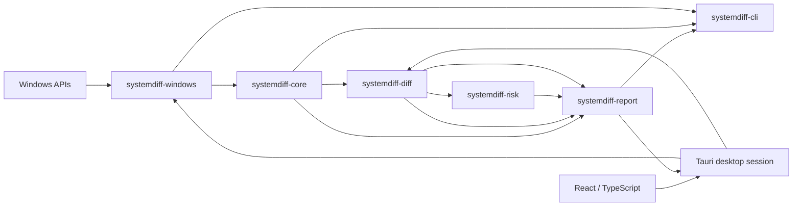

# Architecture

## Purpose

SystemDiff turns non-atomic, privilege-dependent Windows observations into deterministic evidence documents, compares compatible evidence without inventing certainty, and layers rules and explanations above the raw change record.

The architecture optimizes for one shared core used by CLI and desktop clients. Platform access, diff logic, explanations, presentation, and orchestration remain separable and testable.

## System shape

Dependencies point inward toward stable evidence types. The core does not know about Win32, Tauri, React, terminal styling, or files on disk.

## Package responsibilities

| Package | Responsibility | Must not own |
| --- | --- | --- |
| `systemdiff-core` | Versioned domain/wire types, Collector contract, collection outcomes, privilege and redaction metadata | Win32 calls, CLI parsing, UI text, rules |
| `systemdiff-windows` | Win32/COM adapters, Windows normalization, collector implementations | Diff judgments, localized explanations, remediation |
| `systemdiff-diff` | Pure deterministic comparison and compatibility/coverage semantics | OS access, file I/O, risk classification |
| `systemdiff-risk` | Rule contract and findings that reference changes/evidence | Evidence mutation, GUI rendering, OS access |
| `systemdiff-report` | JSON and human-readable rendering plus a locale-neutral desktop presentation DTO | Collection, platform calls, opening arbitrary files |
| `systemdiff-cli` | Arguments, file I/O, exit codes, composition | Domain or collector business logic |
| `apps/desktop` | Ephemeral guided capture session, narrow Tauri IPC, localized interaction, and evidence inspection | A second core, frontend paths/JSON, direct Win32 logic, evidence classification |

These are source boundaries, not a commitment to a dynamic plugin ABI. Out-of-process collectors, a general event bus, an async runtime, and a dependency-injection framework are intentionally absent.

## Stable abstractions

### Snapshot

A Snapshot is an observed state at a point in time. It records document/schema version, SystemDiff version, UTC capture time, non-identifying Windows metadata, privilege state, enabled collectors, per-collector and per-scope status, redaction status, diagnostics, and typed observations.

Snapshots do not claim to be atomic. Coverage and concurrent-change diagnostics are evidence needed to interpret a later diff.

Snapshot files are untrusted input. The CLI enforces a fixed 64 MiB file ceiling with metadata preflight and a bounded read before handing bytes to core. Core then inspects `document_type` and `schema_version` before constructing the supported v1 wire type. Generated Snapshots pass through a capped serializer before create-new file I/O, so oversized output never creates a destination and existing files are never overwritten. This is an intentionally small synchronous boundary, not a streaming parser or general resource-policy framework.

### Collector

A Collector has a stable ID, version, description, privilege expectations, and synchronous `collect` operation. Synchronous collection matches the blocking Win32/COM APIs in the MVP and avoids introducing an async runtime before concurrency is required.

Collection returns observations plus status and diagnostics. The orchestrator records recoverable failure; it does not discard successful results from other collectors. Diagnostics use stable codes and optional native numeric error codes. Machine logic never parses localized error messages.

Aggregate status values begin with:

- `complete`
- `partial`
- `permission_denied`
- `unavailable`
- `unsupported`
- `failed`

Individual scopes can have independent status. An absent key with complete access is different from a scope that could not be opened.

### Observation and artifact

Observations use a tagged, typed artifact enum rather than arbitrary text. The MVP types are registry startup entry, Windows service, and scheduled task.

Each observation separates:

- stable Collector ID/version and scope;
- collector-defined canonical identity;
- raw/display evidence;
- stable fields that participate in default comparison;
- volatile fields that are retained only when useful and excluded from default comparison.

Identity is not a `Debug` string, full-JSON hash, localized display name, or executable judgment. Original Windows casing/value text is preserved. Registry startup and Services Collector v1 deliberately use exact UTF-16 name evidence rather than claiming undocumented durable case-folded tokens; their known casing-only false-split limitations are versioned and documented in [collectors.md](collectors.md).

Registry observations keep the native type code separate from a tagged typed decoding result. String, expandable-string, multi-string, DWORD, and QWORD interpretations therefore do not force unknown, binary, or malformed Registry data through a text-only model. A full-content SHA-256 keeps undecoded or truncated values comparable. Optional raw prefixes are limited to 4 KiB and use validated lowercase hex with captured/original sizes and truncation metadata; Collectors do not duplicate raw bytes when decoded evidence is sufficient.

### Diff

Diff builds a stable index from `(collector_id, scope_id, artifact_kind, canonical_identity)`. Duplicate identities are errors, never last-write-wins. Inputs and output changes are sorted so identical semantic input produces byte-stable JSON.

Primary change kinds are Added, Removed, and Modified. Unchanged is opt-in. When coverage cannot support an absence claim, the result is explicitly Inconclusive instead of manufacturing a removal or addition. Evidence for the same identity observed on both sides can establish Modified even when the wider scope is partial; a coverage warning still describes what may be missing.

A confirmed absence requires compatible Collector scopes and complete coverage in both snapshots. Draft v1 rejects a diff when the same Collector ID has different versions, because compatibility cannot be inferred. This conservative default can later be relaxed only for explicitly defined and tested backward-compatible version pairs; the bootstrap does not add that framework. Aggregate Collector status and scope status are validated together so a failed Collector cannot leave a stale scope marked complete.

### Finding and rule

Rules consume changes and produce Findings with stable rule/reason IDs, classification, confidence, explanation key/parameters, and references to underlying change/evidence IDs. Findings do not copy, rewrite, or delete evidence.

User-facing `en-US` and `zh-CN` strings are resolved outside the rule engine. A rule catalog or DSL will not be designed until real rules demonstrate the required authoring and compatibility model.

### Report

Reports support three deliberately separate views over the same typed evidence:

- the default human-readable terminal view leads with recognizable, factual changes and calm coverage limitations;
- the explicit technical terminal view retains Collector version/scope, canonical identity, native evidence, hashes, decode status, and Snapshot diagnostics;
- deterministic JSON preserves the versioned, language-neutral Diff wire document for tools.

The human renderer consumes a `DiffDocument`. The technical renderer also receives the two already validated source Snapshots because Collector versions and scoped diagnostics are Snapshot evidence and are intentionally not duplicated into Diff v1. The CLI only selects a renderer; presentation stays in `systemdiff-report`. Terminal renderers escape control characters from untrusted observed strings and do not rely on color or ANSI formatting. Renderers do not rescan the system, execute evidence, or open arbitrary files.

The desktop uses a separate locale-neutral presentation contract from the same crate. Rust maps typed Registry/service evidence into fixed `startup` and `windows_services` groups, determines change kinds and changed service fields, counts confirmed versus inconclusive changes, and emits stable message/field identifiers. The WebView translates those identifiers and lays out already-classified values; it never receives a Snapshot or Diff document to reinterpret. Exact technical text is generated in Rust from the validated before/after Snapshots and retained in memory for on-demand disclosure.

### Desktop session

The desktop session is an application orchestration boundary, not a new evidence schema. One backend-authoritative state machine moves through Ready, Starting, Capturing, Finishing, and Results. Synchronous Win32 collection runs in Tauri's blocking executor, while Rust transitions state before dispatch so duplicate frontend calls cannot start concurrent captures.

Before/after Snapshot documents are ephemeral implementation evidence. They are written with the same 64 MiB ceiling under a backend-selected application-local root, use collision-safe create-new files, and are removed after compare, cancel, or a stable normal exit. A process-lifetime advisory lock prevents a second app instance from recovering an active session. Startup recovery considers only direct child directories with the exact SystemDiff session name, ownership marker, allowlisted entries, path containment, and non-reparse-point checks; it never recursively removes an arbitrary path. In-flight native work cannot be interrupted safely, so exit during that state defers exact cleanup to recovery rather than claiming success. Session paths are never sent to or accepted from React. Results retain only the presentation DTO and technical text in memory; there is no history database.

## Windows collection strategy

Windows collection uses Unicode platform APIs through narrowly feature-gated `windows-rs` bindings:

- Run/RunOnce (implemented): Registry APIs with explicit WOW64 views where applicable.
- Services (implemented): query-only Service Control Manager enumeration plus atomic base/description/delayed configuration reads, with current-token best-effort coverage.
- Scheduled Tasks (planned): Task Scheduler 2.0 COM interfaces with recursive folder traversal.

Command output from `reg.exe`, `sc.exe`, `schtasks.exe`, PowerShell, or WMI is not a data contract and will not be parsed. Detailed coverage and API references live in [collectors.md](collectors.md).

Windows code is the only production area expected to require `unsafe`. Every unsafe block must be minimal, documented with invariants, and wrapped by deterministic safe conversion code. Core, diff, risk, report, and CLI crates forbid unsafe code.

## Privilege and process boundaries

The default process uses the current user token. Elevation is not an all-or-nothing mode: each collector/scope reports what it could observe. The desktop uses `asInvoker`, never requests elevation, and exposes no generic shell, filesystem, network, or process-execution command to the WebView.

The Tauri core process is privileged relative to its WebView. IPC commands must be narrow, typed, and least-privilege. The frontend receives only the evidence necessary for the active view; secrets or platform handles never live in frontend state.

## Privacy and redaction

Reports are sensitive by default. The wire envelope records redaction status from v1. Redaction will be a pure transformation with explicit policy ID/version and tests; it must not masquerade as complete when a value could not be sanitized.

The MVP avoids collecting hostname or stable machine identifiers because the first use case does not require them. Raw task XML and optional Registry raw evidence require special sharing guidance.

## Localization

Core and JSON fields are language-neutral. Findings carry explanation keys and structured parameters. The desktop presentation contract also uses stable language-neutral message and field identifiers. React loads typed `en-US` and `zh-CN` dictionaries, selects Chinese for a `zh*` browser/Windows language, formats ordinary timestamps in the user's locale, and leaves observed Registry/service evidence untranslated. Raw UTC remains available in technical details.

## Dependency policy

Important choices were checked on 2026-08-11. Re-evaluate them when introduced or materially upgraded.

| Dependency | Status and license | Decision |
| --- | --- | --- |
| Rust/Cargo | Stable toolchain; Rust 2024 workspace resolver | Accepted for shared core, memory safety, native distribution, and strong test tooling |
| `serde` / `serde_json` | Active; Apache-2.0 OR MIT; [official repository](https://github.com/serde-rs/serde) | Accepted for explicit versioned JSON wire types |
| `time` | Active; Apache-2.0 OR MIT; [official repository](https://github.com/time-rs/time) | Accepted for standards-based RFC 3339 parsing in core and canonical UTC timestamp formatting in CLI; local-offset and serde features remain disabled |
| `sha2` | Active; Apache-2.0 OR MIT; [RustCrypto repository](https://github.com/RustCrypto/hashes) | Accepted without default features for full native Registry value hashes and versioned evidence identities |
| `windows-rs` | Microsoft-maintained and active; Apache-2.0 OR MIT; [official repository](https://github.com/microsoft/windows-rs) | Accepted in `systemdiff-windows`; only required Win32 feature families are enabled and unsafe calls remain behind narrow adapters |
| `windows-version` | Active; Apache-2.0 OR MIT; [official repository](https://github.com/microsoft/windows-rs) | Accepted for the documented Windows 10/Server version 1709 minimum check without shelling out or parsing localized output |
| `clap` | Active; Apache-2.0 OR MIT; [official repository](https://github.com/clap-rs/clap) | Accepted at the CLI boundary only |
| Tauri 2.11 | Active; Apache-2.0 OR MIT; requires C++ Build Tools and WebView2 on Windows; [prerequisites](https://v2.tauri.app/start/prerequisites/) | Accepted with bundled local content, explicit CSP/capabilities, no privileged plugins, and a separate desktop Cargo lockfile |
| React 19 / TypeScript 6 / Vite 8 | Active; permissive licenses; frontend support windows require regular upgrades | Accepted for the small localized desktop view with exact npm locking; no router, global state, design-system, or general i18n framework |

Do not introduce Tokio/`async-trait`, a database, network client, telemetry SDK, generic shell plugin, or schema generator at runtime without a demonstrated requirement. A build-time JSON Schema generator may be evaluated before v0.1.

## Testing architecture

- Domain/diff/rule/report tests run on any CI host using synthetic fixtures.
- Released JSON versions retain golden read/round-trip fixtures.
- Shuffled input and duplicate identity tests protect deterministic behavior.
- Coverage transitions such as complete → partial protect against false removals.
- Windows adapter tests isolate buffer parsing, normalization, and API error mapping.
- Default CI never writes real Run keys, services, or tasks and never requires elevation.
- The write-capable HKCU Registry E2E is a separate test-only PowerShell harness with two explicit gates, exact-data guarded cleanup, no administrator requirement, and no link into production CLI/API code.
- Desktop CI separately runs locked npm install, TypeScript checking, ESLint, Vite production build, desktop Rust fmt/Clippy/tests on Windows and Ubuntu, and a Windows Tauri no-bundle build. It does not publish a desktop release artifact.
- Desktop Rust tests use injected synthetic Snapshots for state, failure, cleanup, presentation, and coverage behavior. The guarded real desktop dogfood mutation remains opt-in and outside default CI.

## Desktop decision

Tauri's process model keeps Rust core/IPC separate from the system WebView and is materially lighter than duplicating the core in a web service. ADR 0003 is accepted after the focused spike verified the in-process Rust boundary, local-only content, narrow command/capability model, bilingual DTO, and current Windows development prerequisites.

Microsoft documents WebView2 support on Windows 10 SAC 1709 and later, but the Runtime is normally preinstalled only on Windows 10 1803 and later. The development application therefore requires an installed Evergreen Runtime. A Tauri `--no-bundle` executable is not claimed as a clean-machine portable release; missing-Runtime handling, installer/bootstrap choice, signing, and full baseline validation remain release work.
