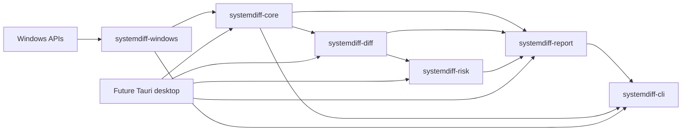

# Architecture

## Purpose

SystemDiff turns non-atomic, privilege-dependent Windows observations into deterministic evidence documents, compares compatible evidence without inventing certainty, and layers rules and explanations above the raw change record.

The architecture optimizes for one shared core used by CLI and desktop clients. Platform access, diff logic, explanations, presentation, and orchestration remain separable and testable.

## System shape

Dependencies point inward toward stable evidence types. The core does not know about Win32, Tauri, React, terminal styling, or files on disk.

## Package responsibilities

| Package | Responsibility | Must not own |
| --- | --- | --- |
| `systemdiff-core` | Versioned domain/wire types, Collector contract, collection outcomes, privilege and redaction metadata | Win32 calls, CLI parsing, UI text, rules |
| `systemdiff-windows` | Win32/COM adapters, Windows normalization, collector implementations | Diff judgments, localized explanations, remediation |
| `systemdiff-diff` | Pure deterministic comparison and compatibility/coverage semantics | OS access, file I/O, risk classification |
| `systemdiff-risk` | Rule contract and findings that reference changes/evidence | Evidence mutation, GUI rendering, OS access |
| `systemdiff-report` | JSON and human-readable rendering to an output stream | Collection, platform calls, opening arbitrary files |
| `systemdiff-cli` | Arguments, file I/O, exit codes, composition | Domain or collector business logic |
| `apps/desktop` | Future localized interaction and evidence inspection | A second core, direct Win32 calls, hidden evidence |

These are source boundaries, not a commitment to a dynamic plugin ABI. Out-of-process collectors, a general event bus, an async runtime, and a dependency-injection framework are intentionally absent.

## Stable abstractions

### Snapshot

A Snapshot is an observed state at a point in time. It records document/schema version, SystemDiff version, UTC capture time, non-identifying Windows metadata, privilege state, enabled collectors, per-collector and per-scope status, redaction status, diagnostics, and typed observations.

Snapshots do not claim to be atomic. Coverage and concurrent-change diagnostics are evidence needed to interpret a later diff.

Snapshot files are untrusted input. The CLI enforces a fixed 64 MiB file ceiling with metadata preflight and a bounded read before handing bytes to core. Core then inspects `document_type` and `schema_version` before constructing the supported v1 wire type. This is an intentionally small synchronous boundary, not a streaming parser or general resource-policy framework.

### Collector

A Collector has a stable ID, version, description, privilege expectations, and synchronous `collect` operation. Synchronous collection matches the blocking Win32/COM APIs in the MVP and avoids introducing an async runtime before concurrency is required.

Collection returns observations plus status and diagnostics. The orchestrator records recoverable failure; it does not discard successful results from other collectors. Diagnostics use stable codes and optional native numeric error codes. Machine logic never parses localized error messages.

Aggregate status values begin with:

- `complete`
- `partial`
- `permission_denied`
- `unavailable`
- `unsupported`
- `failed`

Individual scopes can have independent status. An absent key with complete access is different from a scope that could not be opened.

### Observation and artifact

Observations use a tagged, typed artifact enum rather than arbitrary text. The MVP types are registry startup entry, Windows service, and scheduled task.

Each observation separates:

- stable Collector ID/version and scope;
- collector-defined canonical identity;
- raw/display evidence;
- stable fields that participate in default comparison;
- volatile fields that are retained only when useful and excluded from default comparison.

Identity is not a `Debug` string, full-JSON hash, localized display name, or executable judgment. Original Windows casing/value text is preserved even when comparison uses documented case-insensitive semantics.

Registry observations keep the native type code separate from a tagged typed decoding result. String, expandable-string, multi-string, DWORD, and QWORD interpretations therefore do not force unknown, binary, or malformed Registry data through a text-only model. A full-content SHA-256 keeps undecoded or truncated values comparable. Optional raw prefixes are limited to 4 KiB and use validated lowercase hex with captured/original sizes and truncation metadata; Collectors do not duplicate raw bytes when decoded evidence is sufficient.

### Diff

Diff builds a stable index from `(collector_id, scope_id, artifact_kind, canonical_identity)`. Duplicate identities are errors, never last-write-wins. Inputs and output changes are sorted so identical semantic input produces byte-stable JSON.

Primary change kinds are Added, Removed, and Modified. Unchanged is opt-in. When coverage cannot support an absence claim, the result is explicitly Inconclusive instead of manufacturing a removal or addition. Evidence for the same identity observed on both sides can establish Modified even when the wider scope is partial; a coverage warning still describes what may be missing.

A confirmed absence requires compatible Collector scopes and complete coverage in both snapshots. Draft v1 rejects a diff when the same Collector ID has different versions, because compatibility cannot be inferred. This conservative default can later be relaxed only for explicitly defined and tested backward-compatible version pairs; the bootstrap does not add that framework. Aggregate Collector status and scope status are validated together so a failed Collector cannot leave a stale scope marked complete.

### Finding and rule

Rules consume changes and produce Findings with stable rule/reason IDs, classification, confidence, explanation key/parameters, and references to underlying change/evidence IDs. Findings do not copy, rewrite, or delete evidence.

User-facing `en-US` and `zh-CN` strings are resolved outside the rule engine. A rule catalog or DSL will not be designed until real rules demonstrate the required authoring and compatibility model.

### Report

Reports initially support deterministic JSON and a human-readable terminal view. Renderers receive typed results and an output stream. They do not rescan the system or execute evidence.

## Windows collection strategy

The first collectors use Unicode platform APIs through narrowly feature-gated `windows-rs` bindings:

- Run/RunOnce: Registry APIs with explicit WOW64 views where applicable.
- Services: Service Control Manager enumeration and configuration query APIs.
- Scheduled Tasks: Task Scheduler 2.0 COM interfaces with recursive folder traversal.

Command output from `reg.exe`, `sc.exe`, `schtasks.exe`, PowerShell, or WMI is not a data contract and will not be parsed. Detailed coverage and API references live in [collectors.md](collectors.md).

Windows code is the only production area expected to require `unsafe`. Every unsafe block must be minimal, documented with invariants, and wrapped by deterministic safe conversion code. Core, diff, risk, report, and CLI crates forbid unsafe code.

## Privilege and process boundaries

The default process uses the current user token. Elevation is not an all-or-nothing mode: each collector/scope reports what it could observe. A future GUI must make elevation explicit and must not expose generic shell, filesystem, or process-execution commands to the WebView.

The Tauri core process is privileged relative to its WebView. IPC commands must be narrow, typed, and least-privilege. The frontend receives only the evidence necessary for the active view; secrets or platform handles never live in frontend state.

## Privacy and redaction

Reports are sensitive by default. The wire envelope records redaction status from v1. Redaction will be a pure transformation with explicit policy ID/version and tests; it must not masquerade as complete when a value could not be sanitized.

The MVP avoids collecting hostname or stable machine identifiers because the first use case does not require them. Raw task XML and optional Registry raw evidence require special sharing guidance.

## Localization

Core and JSON fields are language-neutral. Findings carry explanation keys and structured parameters. The future desktop UI loads locale resources for `en-US` and `zh-CN`; business logic contains no hard-coded end-user prose.

## Dependency policy

Important choices were checked on 2026-08-11. Re-evaluate them when introduced or materially upgraded.

| Dependency | Status and license | Decision |
| --- | --- | --- |
| Rust/Cargo | Stable toolchain; Rust 2024 workspace resolver | Accepted for shared core, memory safety, native distribution, and strong test tooling |
| `serde` / `serde_json` | Active; Apache-2.0 OR MIT; [official repository](https://github.com/serde-rs/serde) | Accepted for explicit versioned JSON wire types |
| `time` | Active; Apache-2.0 OR MIT; [official repository](https://github.com/time-rs/time) | Accepted in `systemdiff-core` with only the parsing feature for standards-based RFC 3339 validation; clock, local-offset, formatting, and serde features remain disabled |
| `windows-rs` | Microsoft-maintained and active; Apache-2.0 OR MIT; [official repository](https://github.com/microsoft/windows-rs) | Planned for collectors; enable only required API features and prefer typed bindings |
| `clap` | Active; Apache-2.0 OR MIT; [official repository](https://github.com/clap-rs/clap) | Accepted at the CLI boundary only |
| Tauri 2 | Active; Apache-2.0 OR MIT; requires C++ Build Tools and WebView2 on Windows; [prerequisites](https://v2.tauri.app/start/prerequisites/) | Proposed for v0.2; excluded from v0.1 build until a security-focused spike |
| React / TypeScript / Vite | Active; permissive licenses; frontend support windows require regular upgrades | Proposed with Tauri; lockfile and dependency audit required when introduced |

Do not introduce Tokio/`async-trait`, a database, network client, telemetry SDK, generic shell plugin, or schema generator at runtime without a demonstrated requirement. A build-time JSON Schema generator may be evaluated before v0.1.

## Testing architecture

- Domain/diff/rule/report tests run on any CI host using synthetic fixtures.
- Released JSON versions retain golden read/round-trip fixtures.
- Shuffled input and duplicate identity tests protect deterministic behavior.
- Coverage transitions such as complete → partial protect against false removals.
- Windows adapter tests isolate buffer parsing, normalization, and API error mapping.
- Default CI never writes real Run keys, services, or tasks and never requires elevation.
- Privileged Windows integration tests, if added, are explicit opt-in and use disposable, narrowly named resources.

## Desktop decision

Tauri's process model keeps Rust core/IPC separate from the system WebView and is materially lighter than duplicating the core in a web service. Its security still depends on narrow capabilities and safe Rust commands. The desktop choice remains `Proposed` until the CLI pipeline works and a spike verifies IPC, localization, packaging, WebView2 behavior, and dependency audit results.
