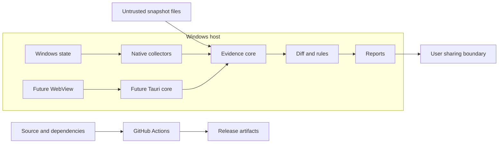

# SystemDiff threat model

## Executive summary

SystemDiff is a local, read-only Windows CLI with a future desktop UI. Its highest risks are misleading evidence caused by incomplete or attacker-controlled collection data, disclosure of privacy-sensitive reports, memory/logic errors at Win32/COM and JSON parsing boundaries, and accidental expansion from observation into privileged execution or remediation. The MVP has no network service, account, telemetry, or cloud dependency, which materially reduces remote exposure.

## Scope and assumptions

In scope:

- runtime boundaries described in `docs/architecture.md`;
- snapshot/diff parsing, collection, rules, reporting, and future Tauri IPC;
- build/CI dependency integrity;
- repository paths `crates/`, future `apps/desktop/`, `fixtures/`, `.github/workflows/`, and `rules/` when created.

Out of scope:

- defending evidence integrity after kernel compromise;
- credential dumping, exploitation, persistence creation, AV/EDR bypass, or remediation features, which are prohibited by `docs/product-principles.md` and `AGENTS.md`;
- cloud services, multi-tenancy, authentication, and telemetry, which do not exist in the MVP;
- a final assessment of Collector implementations that have not yet been written.

Assumptions:

- the user runs SystemDiff locally, normally with the current standard token and optionally with explicit elevation later;
- software changed between snapshots may be untrusted and may race or deceive enumeration;
- snapshot/diff files may come from another machine and are untrusted input;
- reports may be shared publicly despite warnings;
- the future desktop WebView is less trusted than the Rust core process.

Open questions that may change rankings:

- final Windows support matrix and installer/update mechanism;
- whether snapshots will ever be cryptographically signed or compared across machines;
- final Tauri command/capability set;
- public security contact and release-signing process.

## System model

### Primary components

- `systemdiff-cli`: local arguments and file I/O.
- `systemdiff-core`: versioned evidence and Collector outcome types.
- `systemdiff-windows`: privileged/native API boundary.
- `systemdiff-diff`: pure comparison with coverage semantics.
- `systemdiff-risk`: evidence-referencing enrichment.
- `systemdiff-report`: JSON and terminal serialization.
- future Tauri core/WebView: local IPC and presentation boundary.
- GitHub Actions/dependencies: build and artifact integrity boundary.

### Data flows and trust boundaries

- Windows OS -> Windows collectors: registry bytes, service buffers, task COM/XML via local Win32/COM; current-token ACLs apply; safe wrappers must validate lengths, encodings, HRESULT/Win32 outcomes, and concurrent mutation.
- Snapshot files -> CLI/core parser: attacker-controlled local JSON via file I/O; document header, size/resource limits, typed schema, identity uniqueness, and count limits are required before expensive processing.
- Core evidence -> diff/rules: typed in-process values; compatibility, coverage, deterministic identity, and no evidence execution are the guarantees.
- Diff/findings -> report files/terminal: privacy-sensitive local output; destination choice is user-controlled, and future sanitization must be explicit.
- Future WebView -> Tauri core: typed local IPC; bundled origin, allowlisted commands, least-privilege capabilities, and input validation are required.
- Repository/dependencies -> CI/release artifacts: developer-controlled source plus third-party actions/crates; read-only token permissions, immutable action references, lockfiles, review, and dependency updates reduce risk.

#### Diagram

## Assets and security objectives

| Asset | Why it matters | Security objective |
| --- | --- | --- |
| Raw snapshots and task/registry evidence | May reveal usernames, paths, software, host data, commands, or secrets | C, I |
| Diff/findings integrity | Users may make security or troubleshooting decisions from them | I |
| Collector coverage/status | Prevents missing evidence from becoming false claims | I |
| Current user/admin token | Native collection may run with elevated read access | C, I |
| Rule/explanation identifiers | Must remain stable and evidence-grounded | I |
| CLI/desktop availability | Large inputs or API edge cases should not make the tool unusable | A |
| Build and release artifacts | Users must receive reviewed code rather than substituted binaries | I |

## Attacker model

### Capabilities

- A local unprivileged user or installed program can alter locations it controls between or during snapshots.
- A report/snapshot provider can craft malformed, huge, contradictory, or privacy-sensitive JSON/XML/strings.
- A compromised dependency or CI action can attempt build-time code execution or artifact substitution.
- A future compromised WebView can send any IPC message exposed to it.

### Non-capabilities

- There is no unauthenticated network endpoint, server account, or tenant boundary in the MVP.
- SystemDiff does not claim reliable acquisition against an administrator/kernel attacker controlling Windows APIs.
- Evidence does not grant permission to execute a referenced command or modify the system.

## Entry points and attack surfaces

| Surface | How reached | Trust boundary | Notes | Evidence |
| --- | --- | --- | --- | --- |
| Snapshot/diff JSON | CLI file arguments | File -> parser | Untrusted size, schema, identities, strings | `docs/data-format.md` |
| Registry/service/task APIs | Local collection | Windows -> native adapter | ACLs, races, malformed buffers/strings | `docs/collectors.md` |
| Report destination | CLI output path/stdout | Process -> filesystem/user | Sensitive output and overwrite behavior | `docs/product-principles.md` |
| Rule inputs | Parsed changes | Evidence -> judgment | Rules must reference, not rewrite, evidence | `docs/architecture.md` |
| Future Tauri IPC | WebView commands | Web content -> native core | Narrow commands/capabilities only | `docs/adr/0003-desktop-stack.md` |
| CI dependencies/actions | Pull requests and dependency updates | External supply chain -> build | No secrets on fork code; immutable pins | `.github/workflows/ci.yml` |

## Top abuse paths

1. A program changes or hides an object during enumeration -> Collector reports an apparently empty complete scope -> diff claims Removed -> user receives false evidence.
2. A user attaches an unredacted task/snapshot file to a public issue -> paths, identities, or embedded secrets become public -> privacy loss persists in repository history.
3. A crafted JSON document contains excessive objects/strings or duplicate identities -> parser/index consumes resources or overwrites evidence -> denial of service or misleading diff.
4. Malformed native buffer/string data crosses unsafe FFI conversion -> unchecked length/encoding causes memory or logic failure -> collection crashes or evidence is corrupted.
5. A future WebView compromise invokes an over-broad native command -> evidence path is treated as executable or a generic plugin writes to the system -> privilege impact exceeds read-only scope.
6. A rule parses an observed command and treats a heuristic as fact -> explanation drops uncertainty/raw context -> ordinary users are frightened or advanced users are misled.
7. A compromised CI action/dependency modifies a build -> unsigned/unverified artifact is distributed -> users run attacker code under a trusted project name.

## Threat model table

| Threat ID | Threat source | Prerequisites | Threat action | Impact | Impacted assets | Existing controls (evidence) | Gaps | Recommended mitigations | Detection ideas | Likelihood | Impact severity | Priority |
| --- | --- | --- | --- | --- | --- | --- | --- | --- | --- | --- | --- | --- |
| TM-001 | Local changed software | Can race, deny, or influence a collected scope | Cause incomplete evidence to appear complete | False Added/Removed and incorrect findings | Diff and coverage integrity | Explicit statuses and no-false-removal rule (`docs/adr/0004-collector-failure-and-coverage.md`) | Collectors not implemented | Per-scope coverage, bounded retry, native diagnostics, complete->partial regression fixtures | Count coverage changes and surface prominent report warnings | High | High | High |
| TM-002 | Snapshot provider | Can supply arbitrary local JSON | Exhaust memory/CPU or exploit parser assumptions | CLI denial of service; misleading evidence | Availability and diff integrity | Typed/versioned schema and duplicate rejection (`docs/data-format.md`) | No input limits yet | File-size, object-count, string-size and nesting limits; validate header before body; fuzz parsers later | Structured parse failure codes; resource-limit tests | Medium | Medium | Medium |
| TM-003 | Windows data/API edge case | Collector handles raw buffers/COM values | Trigger unsafe length, lifetime, or encoding bug | Crash, memory corruption, corrupted evidence | Token, evidence, availability | Unsafe isolated to Windows crate (`docs/architecture.md`) | Native adapters absent | Minimal audited unsafe blocks, `windows-rs`, two-call buffer patterns, RAII handles/COM, fuzz pure decoders | Windows crash fixtures and sanitizer/fuzz jobs where practical | Medium | High | High |
| TM-004 | User/workflow mistake | Real report is shared publicly | Publish sensitive raw evidence | Lasting privacy disclosure | Snapshot/report confidentiality | Sensitive-by-default and redaction metadata (`docs/product-principles.md`) | Sanitizer absent | Blocking share warning in UI, documented manual review, policy-versioned pure sanitizer, synthetic issue fixtures | Scan project issues for accidental reports; sanitizer golden tests | High | High | High |
| TM-005 | Future compromised WebView | Desktop exposes broad command/capability | Invoke native execution/write or read excess data | Privilege misuse and boundary violation | Token, host integrity, evidence confidentiality | Proposed narrow IPC (`docs/adr/0003-desktop-stack.md`) | Desktop not yet threat-tested | Bundled content, restrictive CSP, explicit commands, no generic shell/fs/http plugins, command authorization tests | Log command IDs without sensitive payloads; capability review in CI | Low pre-v0.2 | High | Medium |
| TM-006 | Rule author or malformed evidence | Rule sees ambiguous command/path data | Overstate heuristic or detach finding from evidence | Misleading/fearmongering output | Finding integrity and user trust | Evidence-before-judgment principle; findings reference changes (`docs/architecture.md`) | No real rule corpus/reviewer rubric | Stable reason IDs, calibrated classifications, explanation keys, counterexample fixtures, independent review | Golden finding snapshots and rule precision review | Medium | Medium | Medium |
| TM-007 | Supply-chain attacker | Dependency/action update reaches CI | Execute during build or replace artifact | Malicious binaries under project identity | Build/release integrity | Minimal CI permissions and dependency policy (`docs/architecture.md`) | No lockfile/signing/release pipeline yet | Commit lockfiles, pin actions by full SHA, review Dependabot PRs, audit before release, sign Windows artifacts | Dependency review, reproducible checksums, provenance later | Low | High | Medium |
| TM-008 | Feature contributor | Maintainer accepts scope expansion | Add remediation, evidence execution, credential access, or evasion | System modification or dual-use abuse | Host integrity and project trust | Explicit prohibited boundary (`AGENTS.md`, `docs/product-principles.md`) | Policy is review-enforced | Stop and require maintainer decision, ADR and new threat model; keep remediation separate if ever approved | PR checklist and independent security review | Medium | High | High |

## Criticality calibration

- **Critical:** a shipped pre-auth/automatic path to native code execution, arbitrary privileged write, or release artifact substitution with broad exposure. Examples: WebView-to-shell capability reachable by report content; compromised signing/release credentials.
- **High:** likely false forensic conclusions, sensitive report disclosure, or native memory safety bugs with meaningful privilege context. Examples: partial coverage reported as confirmed removal; public raw task XML; exploitable FFI buffer handling.
- **Medium:** bounded local denial of service, misleading but inspectable heuristics, or supply-chain weaknesses requiring maintainer acceptance. Examples: oversized local JSON; noisy rule classification; mutable action tag before releases exist.
- **Low:** low-sensitivity diagnostic leakage or failures requiring implausible access with easy recovery. Examples: non-sensitive version disclosure; a malformed synthetic fixture rejected with an imprecise error.

## Focus paths for security review

| Path | Why it matters | Related Threat IDs |
| --- | --- | --- |
| `crates/systemdiff-core/` | Wire validation, coverage metadata, and evidence invariants | TM-001, TM-002 |
| `crates/systemdiff-windows/` | Sole Win32/COM and unsafe boundary | TM-001, TM-003 |
| `crates/systemdiff-diff/` | Prevents incomplete evidence from becoming false claims | TM-001, TM-006 |
| `crates/systemdiff-risk/` | Converts evidence into calibrated judgment | TM-006, TM-008 |
| `crates/systemdiff-report/` | Serializes privacy-sensitive documents | TM-002, TM-004 |
| `crates/systemdiff-cli/` | Untrusted path/file input and output behavior | TM-002, TM-004 |
| `apps/desktop/` | Future WebView/native privilege boundary | TM-005 |
| `.github/workflows/` | Third-party build code and token permissions | TM-007 |
| `AGENTS.md` | Durable safety and scope enforcement for AI-assisted changes | TM-008 |

## Quality check

- Covered current file, native API, report, rule, and CI entry points plus future desktop IPC.
- Represented every identified trust boundary in at least one threat.
- Separated runtime behavior from CI/build tooling and future components.
- Based deployment/data assumptions on the offline-first local CLI/desktop scope supplied by the maintainer.
- Marked unresolved release, support, contact, and desktop details explicitly.
