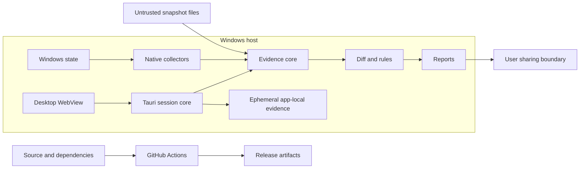

# SystemDiff threat model

## Executive summary

SystemDiff is local, read-only Windows auditing software with a CLI and a guided Tauri desktop development UI. Its highest risks are misleading evidence caused by incomplete or attacker-controlled collection data, disclosure of privacy-sensitive reports or ephemeral desktop sessions, memory/logic errors at Win32/COM and JSON parsing boundaries, and accidental expansion from observation into privileged execution or remediation. The MVP has no network service, account, telemetry, or cloud dependency, which materially reduces remote exposure.

## Scope and assumptions

In scope:

- runtime boundaries described in `docs/architecture.md`;
- snapshot/diff parsing, collection, rules, reporting, and current Tauri IPC/session storage;
- build/CI dependency integrity;
- repository paths `crates/`, `apps/desktop/`, `fixtures/`, `.github/workflows/`, and `rules/` when created.

Out of scope:

- defending evidence integrity after kernel compromise;
- credential dumping, exploitation, persistence creation, AV/EDR bypass, or remediation features, which are prohibited by `docs/product-principles.md` and `AGENTS.md`;
- cloud services, multi-tenancy, authentication, and telemetry, which do not exist in the MVP;
- a final assessment of the still-unimplemented Scheduled Tasks Collector.

Assumptions:

- the user runs SystemDiff locally, normally with the current standard token and optionally with explicit elevation later;
- software changed between snapshots may be untrusted and may race or deceive enumeration;
- snapshot/diff files may come from another machine and are untrusted input;
- reports may be shared publicly despite warnings;
- the desktop WebView is less trusted than the Rust core process.

The production CLI and Collector API remain read-only. A separate developer E2E harness can write one synthetic current-user Run value only after an environment-variable gate and explicit switch; it refuses an existing value and verifies exact type/data before cleanup. Default CI does not run it, and no Registry write binding is reachable from production Rust code.

Open questions that may change rankings:

- installer/update mechanism and any future expansion beyond the current Windows 10/Server version 1709 minimum;
- whether snapshots will ever be cryptographically signed or compared across machines;
- formal desktop installer, WebView2 Runtime bootstrap, and clean-machine baseline behavior;
- public security contact and release-signing process.

## System model

### Primary components

- `systemdiff-cli`: local arguments and file I/O.
- `systemdiff-core`: versioned evidence and Collector outcome types.
- `systemdiff-windows`: privileged/native API boundary.
- `systemdiff-diff`: pure comparison with coverage semantics.
- `systemdiff-risk`: evidence-referencing enrichment.
- `systemdiff-report`: JSON and terminal serialization.
- Tauri core/WebView: local session IPC and presentation boundary.
- GitHub Actions/dependencies: build and artifact integrity boundary.

### Data flows and trust boundaries

- Windows OS -> Windows collectors: the implemented Registry and SCM adapters read native buffers through current-token Win32 access; a future task adapter will add COM. Safe wrappers validate lengths, pointers, encodings, numeric Win32 outcomes, resource budgets, and concurrent mutation.
- Snapshot files -> CLI/core parser: attacker-controlled local JSON via file I/O; a 64 MiB bounded read and header-first schema route precede full Snapshot construction, while typed validation and identity uniqueness protect later processing. Finer object, string, nesting, and count limits remain future hardening.
- Core evidence -> diff/rules: typed in-process values; compatibility, coverage, deterministic identity, and no evidence execution are the guarantees.
- Diff/findings -> report files/terminal: privacy-sensitive local output; destination choice is user-controlled, and future sanitization must be explicit.
- WebView -> Tauri core: typed local IPC; bundled origin, explicit CSP, one-window capability, and five no-path session commands constrain the boundary. The WebView receives a locale-neutral presentation DTO or on-demand technical text, never Snapshot paths/JSON.
- Desktop session -> app-local storage: unredacted before/after evidence is create-new and bounded under an application-owned directory. A process advisory lock, exact ownership marker/allowlist, path containment, non-reparse checks, and non-recursive cleanup limit crash recovery and concurrent-instance risk.
- Repository/dependencies -> CI artifacts: developer-controlled source plus third-party actions/crates; read-only token permissions, immutable action references, the committed Cargo lockfile, review, exact package allowlists, checksums, and artifact-download verification reduce risk.

#### Diagram

## Assets and security objectives

| Asset | Why it matters | Security objective |
| --- | --- | --- |
| Raw snapshots and task/registry evidence | May reveal usernames, paths, software, host data, commands, or secrets | C, I |
| Diff/findings integrity | Users may make security or troubleshooting decisions from them | I |
| Collector coverage/status | Prevents missing evidence from becoming false claims | I |
| Current user/admin token | Native collection may run with elevated read access | C, I |
| Rule/explanation identifiers | Must remain stable and evidence-grounded | I |
| CLI/desktop availability | Large inputs or API edge cases should not make the tool unusable | A |
| Build and release artifacts | Users must receive reviewed code rather than substituted binaries | I |

## Attacker model

### Capabilities

- A local unprivileged user or installed program can alter locations it controls between or during snapshots.
- A report/snapshot provider can craft malformed, huge, contradictory, or privacy-sensitive JSON/XML/strings.
- A compromised dependency or CI action can attempt build-time code execution or artifact substitution.
- A future compromised WebView can send any IPC message exposed to it.

### Non-capabilities

- There is no unauthenticated network endpoint, server account, or tenant boundary in the MVP.
- SystemDiff does not claim reliable acquisition against an administrator/kernel attacker controlling Windows APIs.
- Evidence does not grant permission to execute a referenced command or modify the system.

## Entry points and attack surfaces

| Surface | How reached | Trust boundary | Notes | Evidence |
| --- | --- | --- | --- | --- |
| Snapshot/diff JSON | CLI file arguments | File -> parser | Untrusted size, schema, identities, strings | `docs/data-format.md` |
| Registry/service/task APIs | Local collection | Windows -> native adapter | ACLs, races, malformed buffers/strings | `docs/collectors.md` |
| Report destination | CLI output path/stdout | Process -> filesystem/user | Sensitive output and overwrite behavior | `docs/product-principles.md` |
| Rule inputs | Parsed changes | Evidence -> judgment | Rules must reference, not rewrite, evidence | `docs/architecture.md` |
| Tauri session IPC | WebView commands | Web content -> native core | Bundled local content; fixed no-argument session commands; no shell/fs/http/network plugin | `docs/adr/0003-desktop-stack.md` |
| Desktop temporary evidence | Tauri backend only | Native core -> app-local filesystem | Unredacted, bounded, create-new, exact cleanup/recovery; no frontend paths | `apps/desktop/README.md` |
| CI dependencies/actions | Pull requests and dependency updates | External supply chain -> build | Fork PRs cannot enter the upstream-push artifact upload path; no secrets; immutable pins | `.github/workflows/ci.yml` |

## Top abuse paths

1. A program changes or hides an object during enumeration -> Collector reports an apparently empty complete scope -> diff claims Removed -> user receives false evidence.
2. A user attaches an unredacted task/snapshot file to a public issue -> paths, identities, or embedded secrets become public -> privacy loss persists in repository history.
3. A crafted JSON document contains excessive objects/strings or duplicate identities -> parser/index consumes resources or overwrites evidence -> denial of service or misleading diff.
4. Malformed native buffer/string data crosses unsafe FFI conversion -> unchecked length/encoding causes memory or logic failure -> collection crashes or evidence is corrupted.
5. A WebView compromise invokes an over-broad native command -> evidence path is treated as executable or a generic plugin writes to the system -> privilege impact exceeds read-only scope.
6. A rule parses an observed command and treats a heuristic as fact -> explanation drops uncertainty/raw context -> ordinary users are frightened or advanced users are misled.
7. A compromised CI action/dependency modifies a build -> unsigned/unverified artifact is distributed -> users run attacker code under a trusted project name.

## Threat model table

| Threat ID | Threat source | Prerequisites | Threat action | Impact | Impacted assets | Existing controls (evidence) | Gaps | Recommended mitigations | Detection ideas | Likelihood | Impact severity | Priority |
| --- | --- | --- | --- | --- | --- | --- | --- | --- | --- | --- | --- | --- |
| TM-001 | Local changed software | Can race, deny, or influence a collected scope | Cause incomplete evidence to appear complete | False Added/Removed and incorrect findings | Diff and coverage integrity | Registry has bounded retries/metadata checks; Services uses bounded consecutive config reads and always-partial current-token coverage; both preserve no-false-removal semantics (`docs/adr/0004-collector-failure-and-coverage.md`) | Collection is best-effort, not atomic; Tasks remains unimplemented | Preserve per-scope coverage and bounded native diagnostics; add Collector-specific race fixtures | Count coverage changes and surface prominent report warnings | Medium | High | High |
| TM-002 | Snapshot provider | Can supply arbitrary local JSON | Exhaust memory/CPU or exploit parser assumptions | CLI denial of service; misleading evidence | Availability and diff integrity | 64 MiB bounded file read, header-first version routing, typed schema, and duplicate rejection (`docs/data-format.md`) | No object-count, string-size, nesting, or parser-fuzz limits yet | Add finer structural limits only from measured need; fuzz parsers later | Structured parse failure codes; resource-limit tests | Medium | Medium | Medium |
| TM-003 | Windows data/API edge case | Collector handles raw buffers/COM values | Trigger unsafe length, lifetime, or encoding bug | Crash, memory corruption, corrupted evidence | Token, evidence, availability | Unsafe is isolated to narrow `windows-rs` Registry/SCM adapters with checked units, ranges, pointers, initialized aligned buffers, bounded growth, RAII handles, and strict pure normalization (`docs/architecture.md`) | No fuzzing; Tasks COM adapter not implemented | Keep unsafe blocks minimal and independently reviewed; fuzz pure decoders; apply equivalent discipline to future COM work | Windows regression fixtures and sanitizer/fuzz jobs where practical | Medium | High | High |
| TM-004 | User/workflow mistake | Real report is shared publicly | Publish sensitive raw evidence | Lasting privacy disclosure | Snapshot/report confidentiality | Sensitive-by-default and redaction metadata (`docs/product-principles.md`) | Sanitizer absent | Blocking share warning in UI, documented manual review, policy-versioned pure sanitizer, synthetic issue fixtures | Scan project issues for accidental reports; sanitizer golden tests | High | High | High |
| TM-005 | Compromised desktop WebView | Desktop exposes broad command/capability | Invoke native execution/write or read excess data | Privilege misuse and boundary violation | Token, host integrity, evidence confidentiality | Bundled local content, explicit CSP, main-window capability, fixed no-argument session commands, and no shell/fs/http/network plugin (`docs/adr/0003-desktop-stack.md`) | A future feature/plugin could widen the surface; WebView2 is a platform dependency | Review every new command/capability; keep OS paths and Snapshot JSON backend-only; test command/state authorization | Dependency review and capability diff inspection in every desktop PR | Low | High | Medium |
| TM-009 | Crash, second instance, or local same-user process | Can access or race the desktop app-local directory | Leave, replace, or trick cleanup of unredacted ephemeral Snapshot evidence | Privacy disclosure or deletion of unrelated local data | Snapshot confidentiality and host filesystem integrity | 64 MiB bound, create-new files, process advisory lock, ownership marker, exact direct-child allowlist, canonical containment, reparse rejection, non-recursive deletion, and cleanup tests (`apps/desktop/src-tauri/src/storage.rs`) | Same-user local processes can still read ordinary app-local files; storage is not encryption | Add tested redaction before share/export; revisit stronger at-rest protection only from a concrete threat/user need | Startup recovery summary and deterministic storage failure tests | Low | High | Medium |
| TM-006 | Rule author or malformed evidence | Rule sees ambiguous command/path data | Overstate heuristic or detach finding from evidence | Misleading/fearmongering output | Finding integrity and user trust | Evidence-before-judgment principle; findings reference changes (`docs/architecture.md`) | No real rule corpus/reviewer rubric | Stable reason IDs, calibrated classifications, explanation keys, counterexample fixtures, independent review | Golden finding snapshots and rule precision review | Medium | Medium | Medium |
| TM-007 | Supply-chain attacker | Dependency/action update reaches CI | Execute during build or replace artifact | Malicious binaries under project identity | Build/release integrity | Minimal CI permissions, committed lockfile, immutable action pins, an upstream-push-only preview upload path, exact archive allowlists, SHA-256, PE/manifest inspection, and downloaded-artifact smoke verification (`.github/workflows/ci.yml`) | Preview artifacts are unsigned and expiring; no immutable Release or publisher identity exists | Review Dependabot changes, retain download-back verification, add Authenticode and provenance to a future immutable Release | Dependency review, checksum mismatch failures, artifact inventory, signing verification later | Low | High | Medium |
| TM-008 | Feature contributor | Maintainer accepts scope expansion | Add remediation, evidence execution, credential access, or evasion | System modification or dual-use abuse | Host integrity and project trust | Explicit prohibited boundary (`AGENTS.md`, `docs/product-principles.md`) | Policy is review-enforced | Stop and require maintainer decision, ADR and new threat model; keep remediation separate if ever approved | PR checklist and independent security review | Medium | High | High |

## Criticality calibration

- **Critical:** a shipped pre-auth/automatic path to native code execution, arbitrary privileged write, or release artifact substitution with broad exposure. Examples: WebView-to-shell capability reachable by report content; compromised signing/release credentials.
- **High:** likely false forensic conclusions, sensitive report disclosure, or native memory safety bugs with meaningful privilege context. Examples: partial coverage reported as confirmed removal; public raw task XML; exploitable FFI buffer handling.
- **Medium:** bounded local denial of service, misleading but inspectable heuristics, or supply-chain weaknesses requiring maintainer acceptance. Examples: oversized local JSON; noisy rule classification; mutable action tag before releases exist.
- **Low:** low-sensitivity diagnostic leakage or failures requiring implausible access with easy recovery. Examples: non-sensitive version disclosure; a malformed synthetic fixture rejected with an imprecise error.

## Focus paths for security review

| Path | Why it matters | Related Threat IDs |
| --- | --- | --- |
| `crates/systemdiff-core/` | Wire validation, coverage metadata, and evidence invariants | TM-001, TM-002 |
| `crates/systemdiff-windows/` | Sole Win32/COM and unsafe boundary | TM-001, TM-003 |
| `crates/systemdiff-diff/` | Prevents incomplete evidence from becoming false claims | TM-001, TM-006 |
| `crates/systemdiff-risk/` | Converts evidence into calibrated judgment | TM-006, TM-008 |
| `crates/systemdiff-report/` | Serializes privacy-sensitive documents | TM-002, TM-004 |
| `crates/systemdiff-cli/` | Untrusted path/file input and output behavior | TM-002, TM-004 |
| `apps/desktop/` | WebView/native IPC and ephemeral evidence boundary | TM-004, TM-005, TM-009 |
| `.github/workflows/` | Third-party build code and token permissions | TM-007 |
| `AGENTS.md` | Durable safety and scope enforcement for AI-assisted changes | TM-008 |

## Quality check

- Covered current file, native API, report, rule, CI, desktop IPC, and temporary session entry points.
- Represented every identified trust boundary in at least one threat.
- Separated runtime behavior from CI/build tooling and future components.
- Based deployment/data assumptions on the offline-first local CLI/desktop scope supplied by the maintainer.
- Marked unresolved release, support, contact, WebView2 distribution, and desktop packaging details explicitly.
